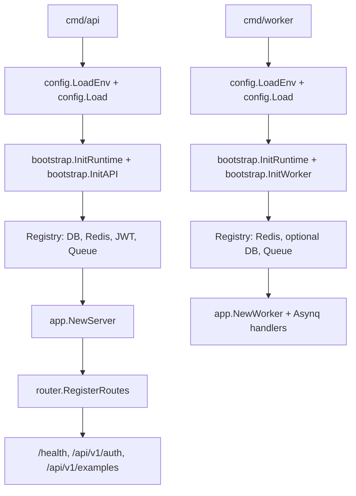

# GinBlade

> **📍 You are on the `examples/transactions` branch.**
>
> This branch is a standalone, runnable example of the **transaction pattern**.
> It is deliberately **never merged into `main`**, which stays a minimal
> skeleton — so nothing here is pending work, it is documentation you can run.
>
> - **Start here:** [Transactions](docs/en/transactions.md) — when you actually
>   need a transaction, the three rules for the `InTx` callback, error mapping,
>   and the SQL guard that stops concurrent overdrafts
> - **The code:** [`internal/service/wallet.go`](internal/service/wallet.go) —
>   a wallet module that orchestrates a debit, a credit, and an audit row inside
>   one transaction
> - **The primitive:** [`internal/repository/tx.go`](internal/repository/tx.go)
> - **Back to the baseline:** `git switch main`

[中文文档](./README.zh-CN.md) · [Architecture](./ARCHITECTURE.md) · [i18n Guide](./I18N.md) · [Docs Site](https://arixbit.github.io/ginblade/)

[](https://github.com/arixbit/ginblade/actions/workflows/ci.yml)
[](https://go.dev/)
[](https://goreportcard.com/report/github.com/arixbit/ginblade)
[](https://github.com/arixbit/ginblade/tags)
[](https://github.com/arixbit/ginblade)
[](https://github.com/arixbit/ginblade/fork)
[](https://github.com/arixbit/ginblade/issues)
[](https://github.com/arixbit/ginblade/commits)
[](https://github.com/arixbit/ginblade/security/dependabot)
[](https://codecov.io/gh/arixbit/ginblade)

An opinionated, runnable Go backend skeleton for services that need clear
boundaries, independently deployable processes, and a delivery path that can
be verified from local development through CI.

## Highlights

- Separate API, Asynq worker, and database migration processes.
- `handler -> service -> repository` application flow with explicit boundaries.
- Hand-written dependency injection and centralized resource lifecycle management.
- Gin, GORM, PostgreSQL, optional Redis and JWT support, and asynchronous tasks.
- Multi-stage, non-root container image and a complete local Docker Compose stack.
- Unit, race, integration, lint, and container smoke verification in CI.

Business modules are intentionally kept minimal. The `Example` flow exists to
show how the layers fit together, not to present a complete product or a
universal architecture.

## Quick Start

Start Postgres, Redis, migrations, the API, and the worker:

```sh
make compose-up
curl http://127.0.0.1:3000/health
```

Override host ports when the defaults are already in use:

```sh
POSTGRES_PORT=55433 REDIS_PORT=56380 API_PORT=53000 make compose-up
```

Stop the stack without deleting its data volumes:

```sh
make compose-down
```

## Structure

- `cmd/api`: HTTP API process.
- `cmd/worker`: Asynq worker process.
- `cmd/migrate`: minimal GORM migration entrypoint for the example and wallet tables.
- `config`: environment loading and typed configuration values.
- `internal/bootstrap`: process-level resource initialization and lifecycle.
- `internal`: application wiring, routes, middleware, and example layers.
- `pkg`: reusable infrastructure helpers, including generic JWT auth.

Two reference flows ship with the skeleton. `Example` covers the baseline
`handler → service → repository` path plus async task publishing. `Wallet`
(`internal/{model,repository,service,handler}/wallet.go`) covers what
`Example` does not: multi-row transactions orchestrated at the service layer,
cache-aside reads, and mapping repository sentinel errors onto `errcode`
values.

Because a transaction is the one thing that is hard to retrofit later, the
wallet module exists mainly to make that pattern copyable. Start with
**[Transactions](docs/en/transactions.md)**; the
[Quick Start](docs/en/quickstart.md) covers the rest.

## Run Locally

```sh
cp .env.example .env
make migrate
go run ./cmd/api
```

Run the worker when Redis is configured:

```sh
go run ./cmd/worker
```

Run the example migration when Postgres is configured:

```sh
go run ./cmd/migrate
```

## Runtime Dependencies

- The API process requires `POSTGRES`.
- Redis is optional for the API process. When configured, it enables cache and queue publishing.
- The worker process requires `REDIS_ADDR`.
- Postgres is optional for the worker process.
- JWT auth example routes are enabled when `JWT_SECRET` is configured.

## Example API

Issue a sample JWT:

```sh
curl -X POST http://127.0.0.1:3000/api/v1/auth/token \
  -H 'Content-Type: application/json' \
  -d '{"subject":"demo"}'
```

Call the protected example endpoint:

```sh
curl http://127.0.0.1:3000/api/v1/auth/me \
  -H "Authorization: Bearer <access_token>"
```

Publish the sample async task when Redis is configured:

```sh
curl -X POST http://127.0.0.1:3000/api/v1/examples/tasks \
  -H 'Content-Type: application/json' \
  -d '{"name":"demo"}'
```

Create two wallets and transfer between them. The debit, the credit, and the
audit row commit or roll back together, so a failed transfer never moves half
the money:

```sh
curl -X POST http://127.0.0.1:3000/api/v1/wallets \
  -H 'Content-Type: application/json' -d '{"name":"alice","balance":100}'
curl -X POST http://127.0.0.1:3000/api/v1/wallets \
  -H 'Content-Type: application/json' -d '{"name":"bob","balance":0}'

curl -X POST http://127.0.0.1:3000/api/v1/wallets/transfers \
  -H 'Content-Type: application/json' -d '{"from_id":1,"to_id":2,"amount":50}'
```

Overdrawing the source wallet returns `INSUFFICIENT_BALANCE` (code `2002`).
`GET /api/v1/wallets` serves from Redis when it is configured and falls back to
the database when it is not.

## Transactions

Use a transaction when one request must change several rows and a half-applied
result would be a bug. Money leaving one wallet and landing in another is the
classic case, which is why the `Wallet` module exists.

Inject `repository.TxRunner` as a `service.TransactionRunner` and wrap the
multi-row work in its callback:

```go
err := s.tx.InTx(ctx, func(txCtx context.Context) error {
	if err := s.repo.Debit(txCtx, req.FromID, req.Amount); err != nil {
		return err
	}
	return s.repo.Credit(txCtx, req.ToID, req.Amount)
})
```

Returning `nil` commits, returning an error rolls back, and every repository
method joins the transaction automatically because it resolves its handle
through `dbFromContext`. The service never imports GORM.

Full walkthrough — the three callback rules, nested transactions, error
mapping, and the SQL guard that prevents concurrent overdrafts:
**[Transactions](docs/en/transactions.md)**.

## Startup Flow



## Deployment Notes

- Swagger is not enabled in this skeleton. Deployment does not require `swag init`.
- If Swagger is added later, generate docs during development or CI build, not at service startup.
- `CORS_ALLOW_ORIGINS` is a comma-separated allow list. Empty means no CORS allow headers.
- Replace `JWT_SECRET` before using the auth example outside local development.
- API business errors use the JSON envelope `code`, `msg`, and `reason`; most API errors are returned with HTTP 200 by convention.
- `/health` uses real HTTP status codes and returns 503 when required dependencies are unavailable.

## Verify

Run the local CI checks (format, module state, vet, race tests, and builds):

```sh
make ci
```

Run real Postgres, Redis cache, and Redis queue integration tests in an
isolated Compose project:

```sh
make integration-up
make test-integration
make integration-down
```

The integration suite has an explicit `integration` build tag and requires
`TEST_POSTGRES_DSN`, `TEST_REDIS_ADDR`, `TEST_REDIS_CACHE_DB`, and
`TEST_REDIS_QUEUE_DB`. `make test-integration` supplies safe local defaults;
CI points the same tests at its Postgres and Redis service containers.
For concurrent worktrees, override `INTEGRATION_PROJECT`,
`INTEGRATION_POSTGRES_PORT`, and `INTEGRATION_REDIS_PORT` with unique values.

Other useful targets are listed by:

```sh
make help
```
